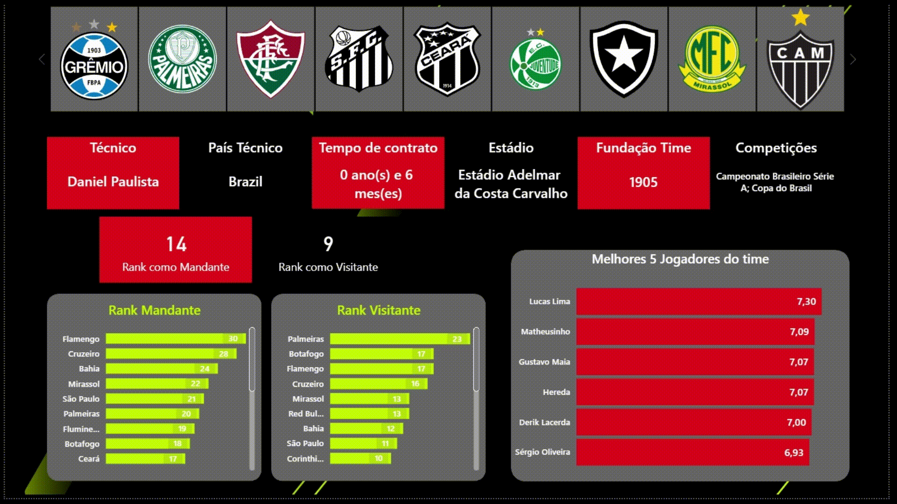
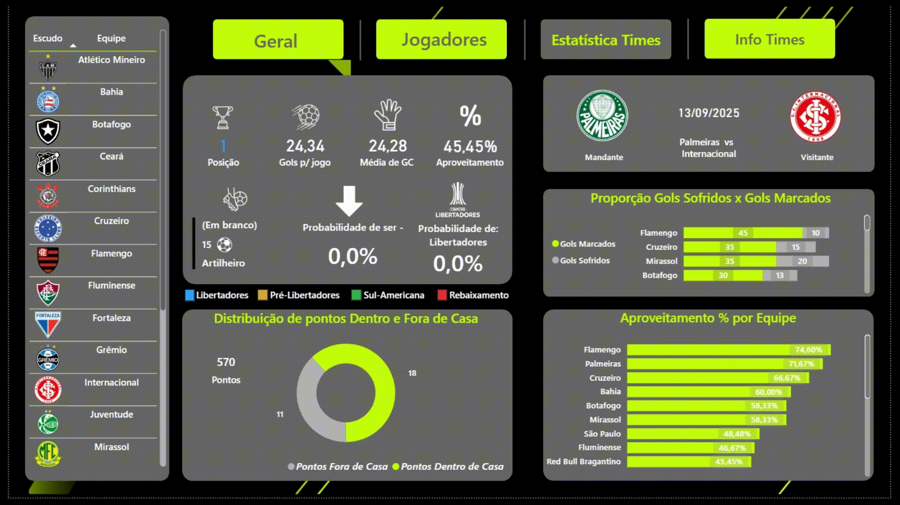

# Brasileirão 2025 PowerDash ⚽📊

## 📊 Prévia do Dashboard

**Página 1 – Home**  
[📄 Abrir Home.pdf](docs/images/Home.pdf)

**Página 2 – Info**  
[📄 Abrir Info.pdf](docs/images/Info.pdf)

**Página 3 – Jogadores**  
[📄 Abrir Jogadores.pdf](docs/images/Jogadores.pdf)

**Página 4 – Tabela**  
[📄 Abrir Tabela.pdf](docs/images/Tabela.pdf)

**Página 5 – Estatística**  
[📄 Abrir Estatistica.pdf](docs/images/Estatistica.pdf)

---

**Interatividade – Visão Geral**  


**Interatividade – Estatísticas**  


---

## ℹ️ Visão geral
Projeto para praticar Power BI usando dados do Brasileirão atualizados por ETL em Python. O fluxo coleta dados da API football-data.org e de scrapers, transforma em tabelas limpas e alimenta o relatório no Power BI.

## 📂 Estrutura do Repositório

```
brasileirao-2025-powerdash/
├── data/
│   ├── raw/            # saídas brutas da API
│   ├── scraper/        # arquivos coletados via scraping
│   ├── prob/           # probabilidades UFMG
│   └── curated/        # camadas finais para o Power BI
│
├── src/
│   ├── common/         # config da API, IO e logging
│   ├── ingest/         # coleta da API football-data.org
│   ├── scraper/        # coleta do ogol e UFMG
│   ├── transform/      # normalização, métricas e dimensões
│   └── pipeline/       # orquestração (run_all.py)
│
├── Dashboard/          # arquivo .pbix do Power BI
├── docs/               # documentação e imagens do projeto
├── requirements.txt    # dependências Python
└── README.md           # este arquivo
```

## 🌐 Fontes de dados
- API: https://api.football-data.org/v4  
  Endpoints consumidos: partidas, artilharia, classificação e times  
  Saídas típicas: `matches_fdorg.json`, `scorers_fdorg.json`, `standings_fdorg.json`, `teams_fdorg.json`
- Scrapers:
  - ogol melhores desempenhos 2025  
  - UFMG probabilidades de rebaixamento, título, vagas continentais  
  Saídas típicas: `ogol_melhores_2025_full.csv`, `prob_ufmg.csv`

## 🔄 Fluxo ETL
1. **Ingest** coleta JSON da API e salva em `data/raw`.  
2. **Scraper** baixa estatísticas do ogol e probabilidades da UFMG para CSV.  
3. **Transform** realiza o T do ETL: limpeza, tipagem, chaves, métricas e junções.  
   Saídas finais em `data/curated` prontas para o Power BI.  
4. **Pipeline** `src/pipeline/run_all.py` executa tudo na ordem.

## ⚡ Setup rápido
Requisitos: Python 3.10+, Power BI Desktop, `requirements.txt`
```bash
python -m venv .venv
# Windows: .venv\Scripts\activate
# Linux/macOS:
source .venv/bin/activate
pip install -r requirements.txt
cp .env.example .env   # preencha com seu token da API
```

### Arquivo .env exemplo
```env
FDORG_BASE_URL=https://api.football-data.org/v4
FDORG_TOKEN=seu_token_aqui
FDORG_COMPETITION=BSA
SEASON=2025
```

## ▶️ Como executar
```bash
python -m src.pipeline.run_all
```

### Resultados esperados
- Brutos em `data/raw`
- Scrapers em `data/scraper` e `data/prob`
- Conjunto final para o relatório em `data/curated`

## 📊 Power BI
- Arquivo principal em `Dashboard/`
- O modelo consome as tabelas de `data/curated`
- Recomendações: modelo em estrela com dimensões de clube e calendário, tipos ajustados e remoção de colunas técnicas não usadas

## 🐍 Requisitos Python mínimos
```txt
requests
pandas
beautifulsoup4
lxml
python-dotenv
```

## 🙏 Agradecimentos e fontes
- API football-data.org v4
- ogol melhores desempenhos 2025
- UFMG probabilidades para Série A

## 👨‍💻 Autor

Pedro Liberal – [GitHub](https://github.com/pedrinhenrik)
